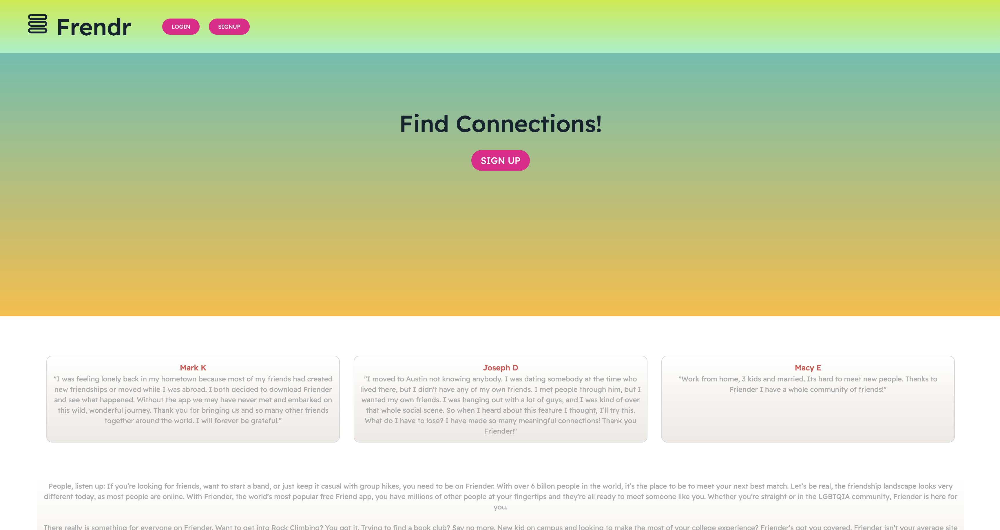
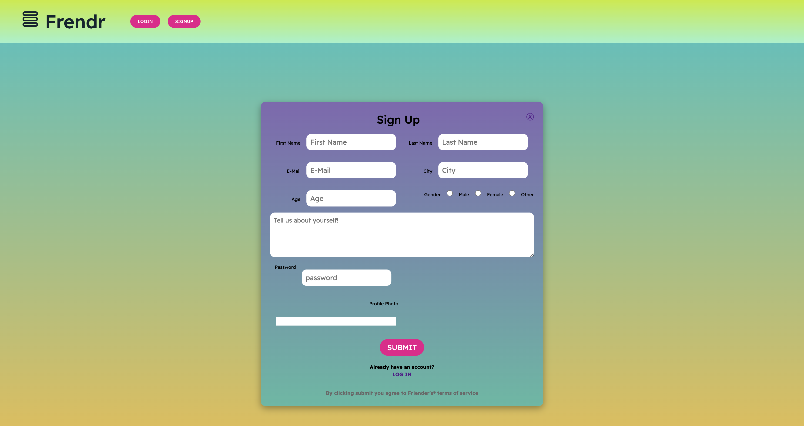
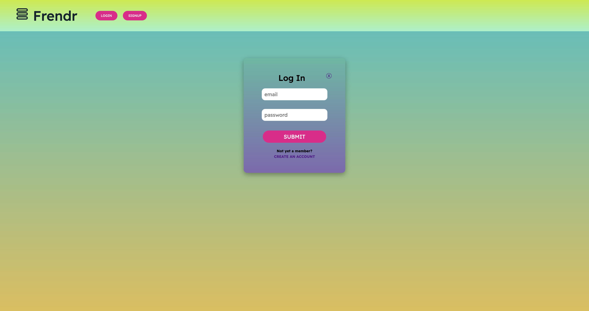
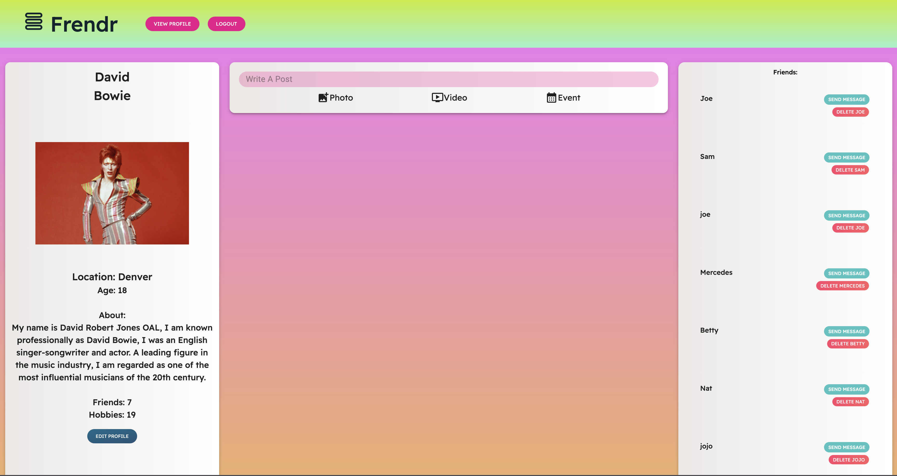
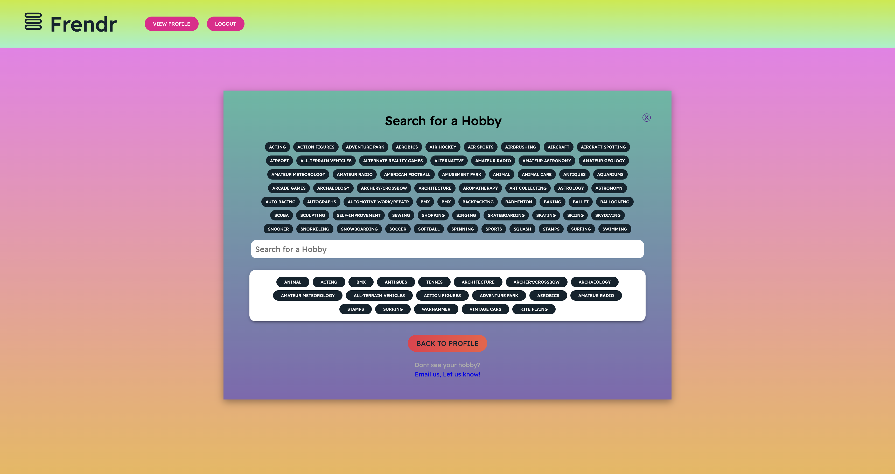
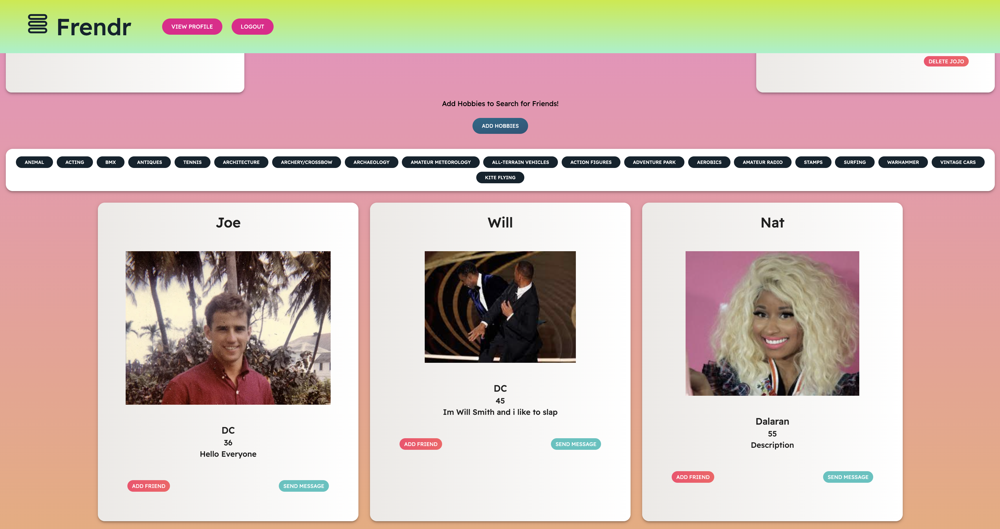

# Friender

## Description
A full-stack MERN application that allows users to connect with each other by searching for similar interests and hobbies.

## Table of Contents
* [Technologies Used](#technologies)
* [Screenshots](#screenshots)
* [Links](#links)
* [License](#license)
* [Contributors](#contributors)

## Technologies Used
* HTML
* CSS
* React
* VSCode
* Node.js
* Express.js
* JavaScript
* MongoDB
* Apollo GraphQL
* bcrypt
* JSON Web Tokens

## Screenshots

## Links
[GitHub Repository](https://github.com/samanthajrexroat/Friender)  
[Deployed Live With Heroku](https://friender-social-media.herokuapp.com/)

## License
MIT

## Contributors
[Joseph Dugan](https://github.com/dugan-jo) 
[Matthew Todor](https://github.com/Ccatalyst) 
[Nick Graves](https://github.com/Thekid303) 
[Samantha Rexroat](https://github.com/samanthajrexroat)
